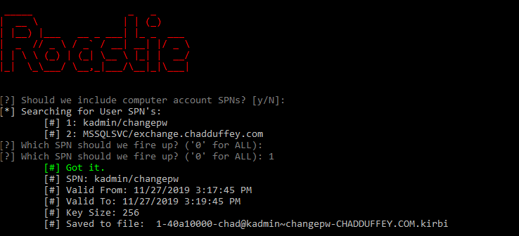

# Roastie!

Not ready for release :) 

## Getting Started

Spending time on C# by attempting to build a point and click kerberoasting app, following the steps here: https://github.com/nidem/kerberoast. 

It's not done yet. Please don't use it for anything important.

You should be using Rubeus: https://github.com/GhostPack/Rubeus 

